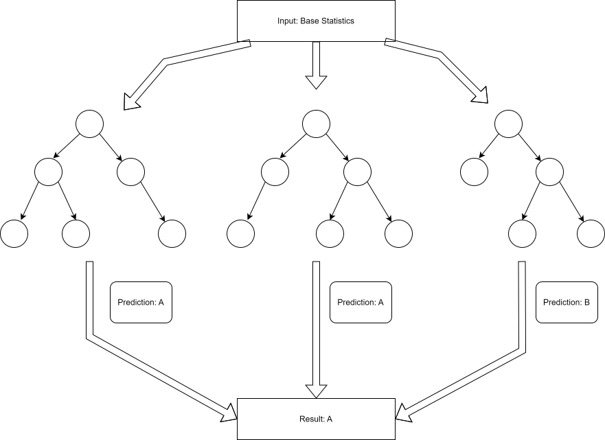

## Running the program:
    - Running the program requires the RuleMining.py to be in the same directory as "./database" which
        contains "All_Pokemon.csv"
    - You need the following Python files in the same directory:
        1. Main.py
        2. RandomForest.py
        3. DecisionTreeClassifier.py
        4. BinaryTree.py
    - You just need to run "python ./Main.py" on timberlea with the above files in the same directory.
    - The result is printed into the terminal. It doesn't show all predictions, only the final accuracy or
        what the algorithm predicted wrong.
    - You don't enter any numbers through the terminal. However, if you want to change parameters you can change
        the global variables:
            - "num_tree" for the number of trees that the forest has.
            - "ratio" for the ratio of split between training data:test data

## Representation of how each prediction works:

## References:
    [1]     https://towardsdatascience.com/under-the-hood-decision-tree-454f8581684e/
    [2]     https://www.w3schools.com/python/numpy/numpy_random.asp
    [3]     https://www.w3schools.com/python/pandas/pandas_dataframes.asp
    [4]     https://www.w3schools.com/python/pandas/ref_df_sort_values.asp
    [5]     https://www.geeksforgeeks.org/python/numpy-argsort-in-python/
    [6]     https://www.geeksforgeeks.org/python/python-numpy-np-unique-method/
    [7]     https://penandpants.com/2014/09/05/performance-of-pandas-series-vs-numpy-arrays/
    [8]     https://en.wikipedia.org/wiki/Sorting_algorithm#Comparison_of_algorithms
    [9]     https://www.learndatasci.com/glossary/gini-impurity/
    [10]    https://www.geeksforgeeks.org/python/numpy-asarray-in-python/
    [11]    https://pandas.pydata.org/pandas-docs/dev/reference/api/pandas.DataFrame.iloc.html